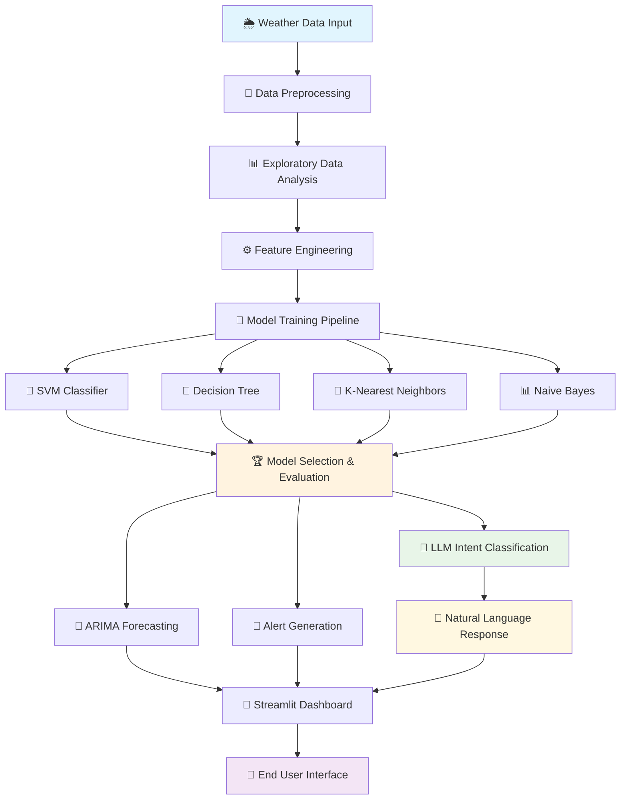

<<<<<<< HEAD
# Weather-Prediction-with-DevOps-Monitoring
A full-stack Machine Learning + DevOps project that predicts weather conditions and monitors application performance using Prometheus &amp; Grafana deployed on Kubernetes (Minikube).
=======
<div align="center">

# 🌦️ Smart Weather Precipitation Prediction and Risk Alert System Enhanced with LLM & Generative AI
<p align="center">
  
  
  
  
  
  
  
  
  
</p>

<p align="center">
  
  
  
</p>

---

## 🎯 Project Vision

Transform weather data into **actionable intelligence** through advanced machine learning algorithms and natural language understanding. This comprehensive system bridges the gap between raw meteorological data and real-world decision-making by providing accurate precipitation classification, humidity forecasting, and intelligent conversational weather insights through integrated LLM capabilities.

> **🚀 Mission**: Democratize weather intelligence for smart cities, agriculture, and climate-resilient infrastructure through AI-powered conversational interfaces

</div>

---

## 📋 Table of Contents

- [🌟 Key Features](#-key-features)
- [🔧 Technology Stack](#-technology-stack)
- [📊 System Architecture](#-system-architecture)
- [🎪 Live Demo](#-live-demo)
- [⚡ Quick Start Guide](#-quick-start-guide)
- [📈 Model Performance](#-model-performance)
- [🔮 Forecasting Engine](#-forecasting-engine)
- [💬 Conversational AI Weather Intelligence](#-conversational-ai-weather-intelligence)
- [🚨 Alert System](#-alert-system)
- [📱 User Interface](#-user-interface)
- [🧪 Technical Implementation](#-technical-implementation)
- [🌍 Real-World Applications](#-real-world-applications)
- [👨‍💻 Author](#-author)

---

## 🌟 Key Features

<table>
<tr>
<td width="50%">

### 🧠 **Intelligent Classification**
- **98.92% Accuracy** with Decision Tree algorithm
- Multi-class precipitation detection
- Real-time confidence scoring
- Robust outlier handling

### 📈 **Advanced Forecasting**
- ARIMA-based humidity prediction
- 3-day forecast horizon
- Trend analysis & visualization

### 🤖 **Conversational AI Integration**
- Natural language weather queries
- Zero-shot intent classification
- Model-grounded predictions
- Human-like response generation

</td>
<td width="50%">

### 🚨 **Smart Alert System**
- Risk-based notification engine
- Probability threshold management
- Multi-level alert categories
- Customizable warning triggers

### ⚡ **Real-Time Simulation**
- Streaming data processing
- Interactive visualizations
- Performance monitoring
- LLM-powered query interface

</td>
</tr>
</table>

---

## 🔧 Technology Stack

<div align="center">

### Core Technologies

| Category | Technologies |
|----------|-------------|
| **🧠 Machine Learning** |    |
| **🤖 Generative AI** |   |
| **📊 Visualization** |    |
| **🌐 Web Framework** |  |
| **📈 Time Series** |  |
| **☁️ Deployment** |   |

</div>

---

## 📊 System Architecture



---

🎪 Live Demo
<div align="center">
🌐 Experience the System Live
<div align="center">
  <a href="https://e2jsej5mcfzgxdxnzazovz.streamlit.app/" target="_blank">
    
  </a>
</div>
🌐 Live Demo URL: https://e2jsej5mcfzgxdxnzazovz.streamlit.app/

</div>

---

## ⚡ Quick Start Guide

<details>
<summary><b>🚀 Click to expand installation steps</b></summary>

### 1️⃣ Prerequisites
```bash
# Ensure Python is installed
python --version
```

### 2️⃣ Clone Repository
```bash
git clone https://github.com/Vishnunandan24/Smart-Precipitation-Classification-and-Forecasting-System-with-Risk-Alerts.git
cd Smart-Precipitation-Classification-and-Forecasting-System-with-Risk-Alerts.git
```

### 4️⃣ Install Dependencies
```bash
pip install -r requirements.txt
```

### 5️⃣ Launch Application
```bash
streamlit run app.py
```

### 6️⃣ Access Dashboard
Open your browser and navigate to: `http://localhost:8501`

</details>

---

## 📈 Model Performance

<div align="center">

### 🏆 Algorithm Comparison

| 🥇 Rank | Algorithm | Accuracy |
|---------|-----------|----------|
| **🥇** | **Decision Tree** | **98.92%** |
| 🥈 | Support Vector Machine | 98.83% |
| 🥉 | K-Nearest Neighbors | 97.94% |
| 4️⃣ | Naive Bayes | 92.94% |


### 🎯 Classification Report of Decision Tree Algorithm
```
                precision    recall  f1-score   support

    No Precipitation   0.06      0.07      0.07       104
              Rain     0.99      0.99      0.99       16470
              Snow     1.00      1.00      1.00       2017
    
         accuracy                          0.99      18591
        macro avg      0.69      0.69      0.69      18591
     weighted avg      0.99      0.99      0.99      18591
```

</div>

---

## 🔮 Forecasting Engine

<div align="center">

### 📈 ARIMA Time Series Modeling

</div>

Our forecasting system utilizes **ARIMA (AutoRegressive Integrated Moving Average)** to predict humidity :

#### 🔬 **Technical Specifications**
- **Model Type**: ARIMA(p,d,q) with automated parameter selection
- **Forecast Horizon**: 3-day rolling predictions
- **Confidence Intervals**: 95% statistical confidence bounds
- **Update Frequency**: Real-time with each new data point (used 1st 5 samples) 

---

## 💬 Conversational AI Weather Intelligence

<div align="center">

### 🤖 **Natural Language Weather Queries with Zero-Shot Learning**

</div>

**Revolutionary Feature**: Our system now integrates advanced **Generative AI capabilities** through Hugging Face Transformers, enabling users to interact with weather predictions using natural language queries!

#### 🧠 **LLM-Powered Intent Understanding**

<table>
<tr>
<td width="50%">

### 🎯 **Zero-Shot Classification Engine**
- **Model**: `MoritzLaurer/DeBERTa-v3-base-mnli-fever-anli`
- **Architecture**: DeBERTa-v3 Transformer
- **Capability**: Zero-shot natural language understanding
- **Performance**: Lightweight, CPU-compatible
- **Deployment**: Streamlit Cloud optimized

### 💡 **Natural Query Examples**
```
🌧️ "Will it rain tomorrow?"
☂️ "Should I carry an umbrella?"
🌨️ "Is snowfall expected today?"
🌤️ "What's the weather risk level?"
🌈 "Will there be precipitation?"
```

</td>
<td width="50%">

### ⚡ **Intent Classification Labels**
- `"Will it rain tomorrow?"`
- `"No precipitation"`  
- `"Give rainfall risk"`
- `"Should I carry umbrella?"`
- `"Is it going to snow?"`
- `"Weather prediction query"`
- `"Safe weather conditions"`

### 🔗 **Model Integration Pipeline**
1. **Natural Language Input** → User types question
2. **Intent Classification** → LLM determines weather intent  
3. **Model Selection** → Links to chosen ML model
4. **Real-time Prediction** → Processes current weather inputs
5. **AI Response** → Generates human-like weather advice

</td>
</tr>
</table>

#### 🎪 **Interactive Conversational Experience**

```python
# Example LLM Integration Flow
def process_weather_query(user_prompt, weather_inputs):
    """
    Advanced conversational AI weather intelligence
    """
    # Zero-shot intent classification
    intent_labels = [
        "Will it rain tomorrow?",
        "No precipitation", 
        "Give rainfall risk",
        "Should I carry umbrella?",
        # ... more weather-related intents
    ]
    
    # DeBERTa-v3 classification
    classified_intent = llm_classifier(user_prompt, intent_labels)
    
    # Model-grounded prediction
    weather_prediction = selected_model.predict(weather_inputs)
    
    # Generate natural language response
    if weather_prediction == "Rain" and probability > 0.90:
        return "🌧️ Yes, rain is very likely! I'd recommend carrying an umbrella."
    elif weather_prediction == "No Precipitation":
        return "☀️ Clear skies ahead! No need for rain gear today."
    # ... intelligent response generation
```

#### 🚀 **Key LLM Integration Benefits**

<div align="center">

| Feature | Traditional Interface | **🤖 LLM-Enhanced Interface** |
|---------|----------------------|-------------------------------|
| **User Input** | Manual parameter entry | Natural language queries |
| **Understanding** | Structured data only | Context-aware interpretation |
| **Response Style** | Technical predictions | Human-like weather advice |
| **Accessibility** | Requires weather knowledge | Intuitive for all users |
| **Engagement** | Static interaction | Conversational experience |

</div>

#### 🔬 **Technical Implementation Highlights**

- **🎯 Zero-Shot Learning**: No additional training required for new weather queries
- **⚡ CPU Optimization**: Runs efficiently on low-resource environments
- **🌐 Cloud Ready**: Seamlessly deployed on Streamlit Cloud
- **🔗 Model Agnostic**: Works with any selected ML algorithm (SVM, Decision Tree, KNN, Naive Bayes)
- **📊 Real-time Processing**: Instant intent classification and response generation
- **🛡️ Robust Handling**: Graceful fallback for ambiguous queries

#### 💭 **Sample Conversational Interactions**

<table>
<tr>
<td width="50%">

**🗣️ User Query**: *"Should I cancel my outdoor picnic?"*

**🤖 AI Response**: *"Based on the current conditions with 92% rain probability, I'd recommend postponing your outdoor picnic. Rain is very likely today!"*

</td>
<td width="50%">

**🗣️ User Query**: *"Is it safe to drive to work?"*

**🤖 AI Response**: *"Weather conditions look clear with no precipitation expected. Safe driving conditions ahead!"*

</td>
</tr>
</table>

This **groundbreaking integration** transforms our weather prediction system from a traditional ML application into an **intelligent conversational AI assistant** that understands natural language and provides contextual, human-like weather insights!

---

## 🚨 Alert System

<div align="center">

### ⚡ Intelligent Risk Assessment Engine

</div>

Our AI-powered alert system provides **contextual warnings** based on prediction confidence and weather severity:

#### 🎚️ **Alert Categories**

<table>
<tr>
<td width="25%" align="center">

### 🚨 **CRITICAL**
**Rain + 90%+ Confidence**
- Rainfall alert - stay safe


</td>
<td width="25%" align="center">

### ⚠️ **HIGH**
**Snow or Rain + 80%+ Confidence**
- Snowfall Expected


</td>
<td width="25%" align="center">

### ✅ **LOW**
**No Precipitation + 80%+ Confidence**
- Safe conditions
- Normal operations
- Clear weather expected

</td>
</tr>
</table>

#### 🧠 **Smart Alert Logic**
```python
def generate_intelligent_alert(prediction, probability, humidity_trend):
    """
    Multi-factor alert generation considering:
    - Precipitation type and probability
    - Humidity trend analysis
    - Historical risk patterns
    - Seasonal adjustments
    """
    if prediction == "Rain" and probability > 0.90:
        if humidity_trend > 80:
        return "🚨 HIGH RISK: Rainfall Alert - Stay Safe"
    
    elif prediction == "Snow" and probability > 0.85:
        return "❄️ WINTER ALERT: Snowfall Expected - Travel Caution"
    
    elif prediction == "No Precipitation" and probability > 0.80:
        return "✅ CLEAR SKIES: Safe Weather Conditions"
    
    else:
        return "🔍 UNCERTAIN: Monitor Weather Closely"
```

---

## 📱 User Interface

<div align="center">

### 🎨 Interactive Streamlit Dashboard

</div>

Our user-friendly interface provides comprehensive weather intelligence through multiple interactive sections:

#### 🏠 **Dashboard Sections**

<table>
<tr>
<td width="25%" align="center">

### 📊 **Analytics Hub**
- Correlation heatmaps
- Distribution analysis
- Outlier detection
- Feature importance

</td>
<td width="25%" align="center">

### 🔮 **Prediction Center**
- Real-time classification
- Confidence scoring
- Model comparison
- Performance metrics

</td>
<td width="25%" align="center">

### 📈 **Forecast Studio**
- ARIMA predictions
- Trend visualization
- Confidence intervals

</td>
<td width="25%" align="center">

### 💬 **AI Chat Interface**
- Natural language queries
- Conversational responses
- Intent classification
- Smart recommendations

</td>
</tr>
</table>

#### 🎛️ **Interactive Controls**
- **Model Selection**: Choose between SVM, Decision Tree, KNN, or Naive Bayes
- **Alert Sensitivity**: Customize warning thresholds
- **Visualization Options**: Toggle between different chart types
- **LLM Query Interface**: Ask questions in natural language

---

## 🧪 Technical Implementation

<details>
<summary><b>🔬 Advanced Technical Details</b></summary>

### ⚙️ **Feature Engineering Pipeline**

```python
def create_weather_features(df):
    """
    Advanced feature engineering for weather prediction
    """
    # Rolling statistics
    df['humidity_ma_7'] = df['humidity'].rolling(window=7).mean()
    df['humidity_std_7'] = df['humidity'].rolling(window=7).std()
    
    # Lag features
    df['humidity_lag_1'] = df['humidity'].shift(1)
    df['humidity_lag_3'] = df['humidity'].shift(3)
    
    # Interaction features
    df['temp_humidity_interaction'] = df['temperature'] * df['humidity']
    df['pressure_humidity_ratio'] = df['pressure'] / df['humidity']
    
    # Seasonal decomposition
    decomposition = seasonal_decompose(df['humidity'], model='additive')
    df['humidity_trend'] = decomposition.trend
    df['humidity_seasonal'] = decomposition.seasonal
    
    return df
```
</details>

---

## 🌍 Real-World Applications

<div align="center">

### 🎯 Industry Impact & Use Cases

</div>

<table>
<tr>
<td width="50%">

#### 🌾 **Smart Agriculture**
- **Irrigation Optimization**: Predict humidity to schedule efficient watering
- **Crop Protection**: Early frost and precipitation warnings
- **Yield Forecasting**: Weather-based crop yield predictions
- **Pest Management**: Weather-driven pest outbreak alerts

#### 🏙️ **Smart Cities**
- **Traffic Management**: Weather-based traffic flow optimization
- **Emergency Response**: Proactive disaster preparedness
- **Energy Grid**: Weather-informed energy demand forecasting
- **Public Safety**: Citizens weather alert system

</td>
<td width="50%">

#### 🚛 **Logistics & Transportation**
- **Route Planning**: Weather-aware delivery optimization
- **Fleet Management**: Vehicle maintenance scheduling
- **Supply Chain**: Weather impact on logistics networks
- **Aviation**: Flight planning and delay predictions

#### ⚡ **Energy Sector**
- **Renewable Energy**: Solar/wind power generation forecasting
- **Grid Stability**: Weather-based load balancing
- **Maintenance**: Weather-dependent infrastructure maintenance
- **Demand Response**: Weather-driven energy consumption patterns

</td>
</tr>
</table>


>>>>>>> 39ea001 (Initial Commit)
